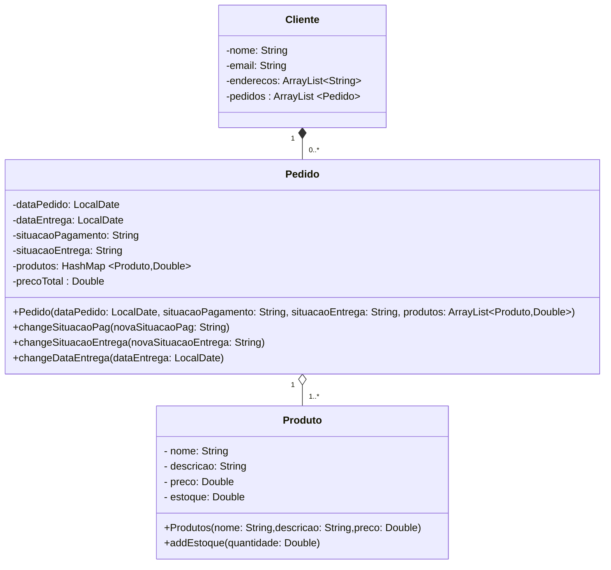

# Comércio

- Um produto tem uma descrição, um preço e uma quantidade em estoque.
- Um cliente tem um nome, um e-mail e um ou mais endereços de entrega.
- Um cliente pode fazer um ou mais pedidos. 
- Um pedido tem uma data, uma situação (pendente, pago, entregue, cancelado), um ou mais produtos, sendo que cada produto
tem uma quantidade e um preço unitário.

Composição	*--	Diamante preenchido
Agregação	o--	Diamante vazio
Dependência	..>	Linha tracejada com seta