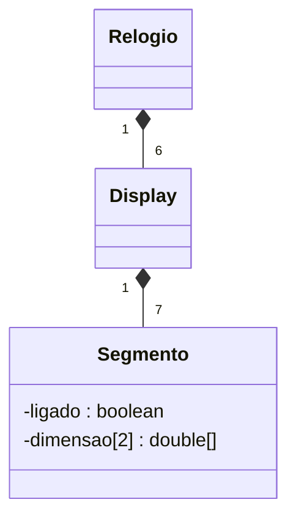

```mermaid
classDiagram
       
    class Relogio {

    }
    
    class Display{
  
        
    }
    class Segmento{
        -ligado : boolean
        -dimensao[2] : double[]
        
        
    }

Relogio "1" *-- "6" Display
Display "1" *-- "7" Segmento

```
